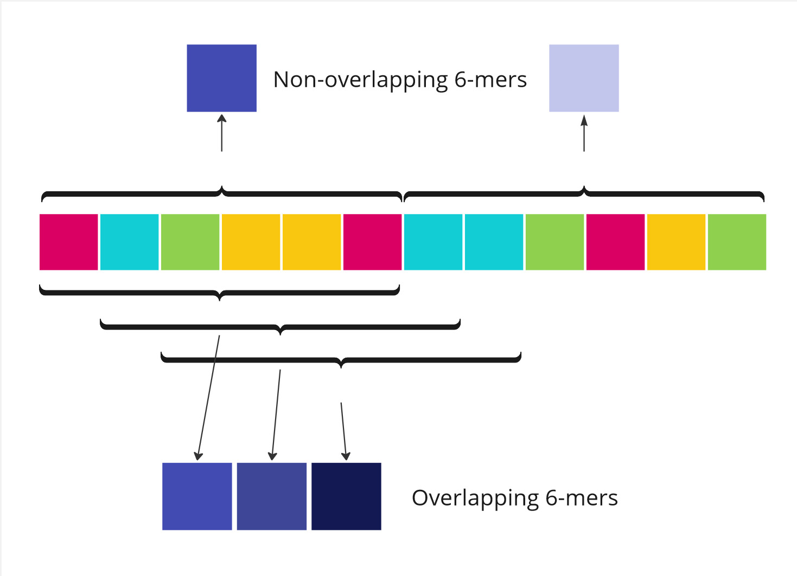
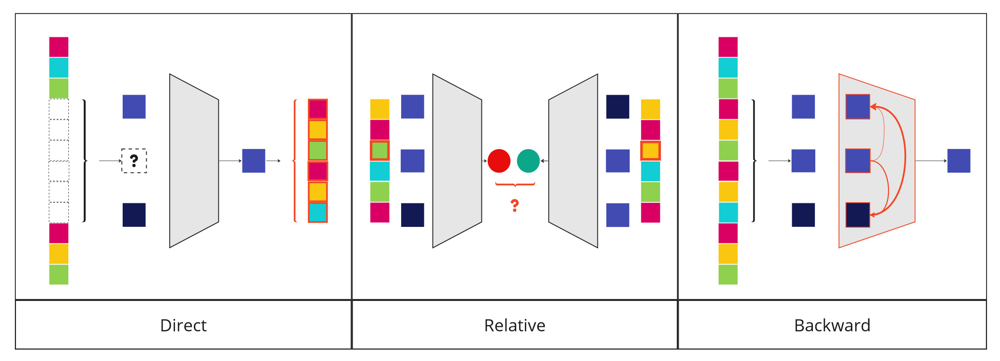
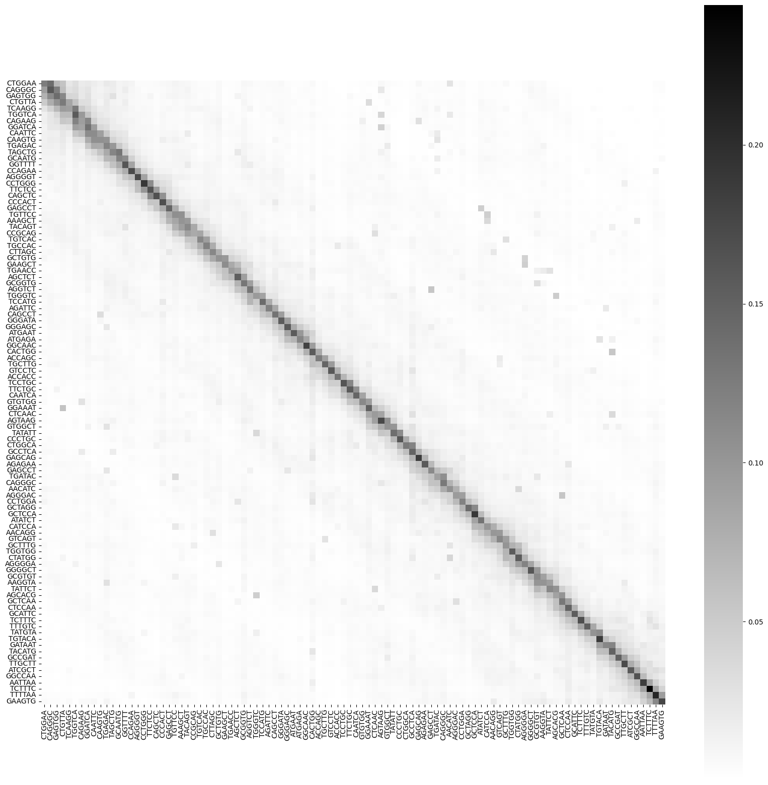

Title: Fundational Genomic Models
Date: 2024-01-15
Category: Biology
Tags: genomics, llm, foundation-models
Author: Simon Popelier
Summary: Introduction to foundation models for genomics.
JS: nucleotide_attention.js (bottom) 

# Introduction

Foundation models are a common feature of language modeling. Architectures such as BERT and GPT have proved themselves over the last years as generalist families of models able to solve a wide range of problems.

Inspired by this work, several research projects are attempting to apply the same ideas to another type of data: DNA sequences.

<figure style="padding-left: 0px;margin-left: 0px;">

<figcaption style="text-align: center;">Nucleotide Transformer clipped attention weights on a hundred nucleotides from GRCh38 chromosome 11.</figcaption>
</figure>

# From text to DNA

One may ask why using NLP-born techniques in the field of genomics is relevant. 

This is due both to the nature of the task as well as the availability of data to perform it. 

## The nucleic acid sequence

One of the main components of DNA is its nucleotide sequence.

This sequence of molecules, called [nucleotides](https://en.wikipedia.org/wiki/Nucleotide), can take one of 4 forms (bases): Adenine, Thymine, Cytosine and Guanine.

It is then tempting to draw an analogy between a chain of nucleotides and the words of a sentence, DNA sequences and sentences or paragraphs.

If the form corresponds, so does the substance. Indeed, nucleotide sequences are particularly informative about the function of different biological processes. If decoding a text enables us to understand its message, decoding a DNA sequence helps deriving numerous biological results.

More genrally, the practice of applying text mining (including NLP approaches) to biology is called [Biomedical text mining](https://en.wikipedia.org/wiki/Biomedical_text_mining).

## The DNA corpus

So the idea of applying the methods developed in the field of NLP is particularly relevant to DNA sequences. But are the conditions right for it to work?

For one thing, DNA sequences are long. Very long. On the other, they are diverse. The [human genome](https://en.wikipedia.org/wiki/Human_genome) alone is composed of about 3 billion nucleotide pairs.

On the other hand, it has been empirically demonstrated that the deductions that can be drawn from DNA sequences are partly transferable from one species to another. This means that it is possible to train a model intended for the study of several species together or to train a model intended for one species in particular with the help of knowledge acquired from others. The [Nucleotide Transformer](https://www.biorxiv.org/content/10.1101/2023.01.11.523679v1) proposes for a multispecies model trained on 850 different species at once. 

The available corpus is immense, enabling the use not only of NLP techniques but LLMs and foundation models in particular.

# Models

## Learning objective

The founding principle of this type of model is unsupervised training. Even more so than in NLP, the acquisition of labeled data in biology is particularly costly in terms of time and resources. It is therefore particularly beneficial to be able to bypass it.

The results of [AgroNT](https://www.biorxiv.org/content/10.1101/2023.01.11.523679v1) show that the gain produced by access to a much larger corpus enables us to gain in performance without the need for labels.

In this way, the methods used for learning are based on those of unsupervised NLP, such as [Next Sentence Prediction](https://en.wikipedia.org/wiki/BERT_(language_model)#Pretraining), [Masked Language Modeling](https://en.wikipedia.org/wiki/BERT_(language_model)#Pretraining) and [Next Token Prediction](https://huggingface.co/blog/alonsosilva/nexttokenprediction).

## **Tokenization**

In NLP, advanced tokenization techniques such as [Byte Pair Encoding](https://en.wikipedia.org/wiki/Byte_pair_encoding) or [WordPiece](https://arxiv.org/abs/1609.08144) have been developed.

Today, tokenization of DNA sequence models mostly relies on [*k*-mers](https://en.wikipedia.org/wiki/K-mer), fixed-length sequences of *k* nucleotides.

These often perform well since related to biological concepts such as codons, sequences of 3 nucleotides that map to amino-acids and are a subset of 3-mers (see [k=3](https://en.wikipedia.org/wiki/K-mer#k_=_3)). It is often said that the frequency of *k*-mers in a genomic region is akin to a signature. 

<figure>
    
    <figcaption style="text-align: center;">Illustration of the 6-merization of a sequence of 12 nucleotide in a overlapping and non-overlapping fashion.</figcaption>
</figure>

## Architectures

### Core architecture

The majority of architectures are based on those that have proved their worth in NLP, namely [BERT](https://en.wikipedia.org/wiki/BERT_(language_model)) and [GPT](https://en.wikipedia.org/wiki/Generative_pre-trained_transformer) derivatives.

Architectures based on CNNs and RNNs have given way to Transformers. 

Since sequences of DNA can be influenced by far away other sequences, models allowing long-range interactions like [Enformer](https://www.nature.com/articles/s41592-021-01252-x) shine the most. 

Other Transformer architectures, such as expert mixtures, or completely different architecture like State Space Models are likely to emerge in the near future.

### Positional Encodings

Similarly, many models use positional encoding techniques developped for NLP such as [RoPE](https://arxiv.org/abs/2104.09864) and [ALiBi](https://arxiv.org/abs/2108.12409).

However, it is quite possible that specific methods for DNA sequences will emerge over time. Indeed, the physical structure of DNA sequences plays an important role in inter-sequence interactions. For example, models like [Akita](https://www.ncbi.nlm.nih.gov/pmc/articles/PMC8211359/) are capable of learning genome folding.

# Applications

While the use of a model that knows how to manipulate the words in a sentence may seem intuitive, the use of a model that manipulates DNA sequences is less so. Yet there are countless applications for these models.

## Uses

A model based on DNA sequences can be used in a variety of ways.

<figure>
    
    <figcaption style="text-align: center;">Different usages of a same foundational model.</figcaption>
</figure>

### Direct usage

The most obvious way is to specialize it so that it predicts a value directly from the sequences read as input. This is the case, for example, with gene expression prediction.

### Relative usage

The model can also be used to compare two different sequences. This is the case when analyzing the dangerousness of a mutation. The model's prediction can then be compared for two sequences involving two alleles.

### Backward usage

It can also be used in reverse to understand the mechanisms it models and extrapolate them to real mechanisms. Such a model can be used to explore a vast space at low cost, performing large scale *in silico* experiments.

Interpretability analyses help understanding which sequences work in cores with others. Attention or gradient interpretability analyses can be used in this context.

In the case of [Enformer](https://www.nature.com/articles/s41592-021-01252-x), we can observe that the model focuses its attention on the same side of the TAD boundary when it performs a prediction on this side.

<figure>
    
    <figcaption style="text-align: center;">Last layer attention matrix in Nucleotide Transformer inference on a hundred token from GRCh38 chromosome 11.</figcaption>
</figure>

## Adaptation

For many of these applications, it is necessary to specialize the model.

### Probing

The most traditional way of specializing the model is to train a successor model that uses the representation learned from the model. An example of this is logistic regression.

### Fine Tuning

The most effective methods, however, consist in allowing the entire model to adapt to the final task. This is known as fine-tuning, and all the techniques developed for LLM also apply here: [IA3](https://huggingface.co/docs/peft/conceptual_guides/ia3), [LoRA](https://huggingface.co/docs/peft/conceptual_guides/lora).

### Zero-Shot learning

However, it is possible to use a foundation model without even specializing it. These techniques are called zero-shot learning. This is the case, for example, when a variation hazard score (SNV) is extracted directly from the various MLM task predictions like the [Genomic Pre-trained Network score](https://www.biorxiv.org/content/10.1101/2022.08.22.504706v2).

<illustration du gene score>

## Research

### NLP performance replication

On the one hand, the field is lagging behind the latest advances in LLMs. Each of these advances represents an avenue for research into the portability of new techniques in the field of genomics.

### Specific extension to genomics

On the other hand, it is possible to study further how to make these models good specifically in their domain.

What's more, as the topic is still in its infancy, it lacks benchmarks and fully mature datasets. As a result, numerous papers have been published on these subjects. For example, [AgroNT](https://www.biorxiv.org/content/10.1101/2023.10.24.563624v1) comes with its own new Plants Genomic Benchmark.

# Conclusion

The concept of foundational model has successfully transfered to the genomics field. It currently relies on the same transformer models that have succeeded in the NLP domain. Yet it is still at its infancy, and many biology specific models are yet to be developped. Check out ["To Transformers and Beyond"](https://arxiv.org/abs/2311.07621) to learn more about the topic! 

# References

Avsec, Žiga et al. 2021. « Effective Gene Expression Prediction from Sequence by Integrating Long-Range Interactions ». Nature Methods 18(10): 1196‑1203.

Benegas, Gonzalo, Sanjit Singh Batra, et Yun S. Song. 2023. « DNA Language Models Are Powerful Zero-Shot Predictors of Genome-Wide Variant Effects ». : 2022.08.22.504706. https://www.biorxiv.org/content/10.1101/2022.08.22.504706v2 (14 janvier 2024).

Consens, Micaela E. et al. 2023. « To Transformers and Beyond: Large Language Models for the Genome ». http://arxiv.org/abs/2311.07621 (15 janvier 2024).

Dalla-Torre, Hugo et al. 2023. « The Nucleotide Transformer: Building and Evaluating Robust Foundation Models for Human Genomics ». : 2023.01.11.523679. https://www.biorxiv.org/content/10.1101/2023.01.11.523679v1 (14 janvier 2024).

van Dijk, Aalt Dirk Jan, Gert Kootstra, Willem Kruijer, et Dick de Ridder. 2021. « Machine learning in plant science and plant breeding ». iScience 24(1): 101890.

Esposito, Salvatore, Domenico Carputo, Teodoro Cardi, et Pasquale Tripodi. 2020. « Applications and Trends of Machine Learning in Genomics and Phenomics for Next-Generation Breeding ». Plants 9(1): 34.

« FEB94 A New Algorithm for Data Compression ». http://www.pennelynn.com/Documents/CUJ/HTML/94HTML/19940045.HTM (16 janvier 2024).
Fudenberg, Geoff, David R. Kelley, et Katherine S. Pollard. 2020. « Predicting 3D genome folding from DNA sequence with Akita ». Nature methods 17(11): 1111‑17.

Hastings, Janna. 2017. « Primer on Ontologies ». In The Gene Ontology Handbook, Methods in Molecular Biology, éd. Christophe Dessimoz et Nives Škunca. New York, NY: Springer, 3‑13. https://doi.org/10.1007/978-1-4939-3743-1_1 (17 décembre 2023).

Mendoza-Revilla, Javier et al. 2023. « A Foundational Large Language Model for Edible Plant Genomes ». : 2023.10.24.563624. https://www.biorxiv.org/content/10.1101/2023.10.24.563624v1 (14 janvier 2024).

Press, Ofir, Noah A. Smith, et Mike Lewis. 2022. « Train Short, Test Long: Attention with Linear Biases Enables Input Length Extrapolation ». http://arxiv.org/abs/2108.12409 (16 janvier 2024).

Su, Jianlin et al. 2023. « RoFormer: Enhanced Transformer with Rotary Position Embedding ». http://arxiv.org/abs/2104.09864 (16 janvier 2024).
Wu, Yonghui et al. 2016. « Google’s Neural Machine Translation System: Bridging the Gap between Human and Machine Translation ». http://arxiv.org/abs/1609.08144 (16 janvier 2024).
