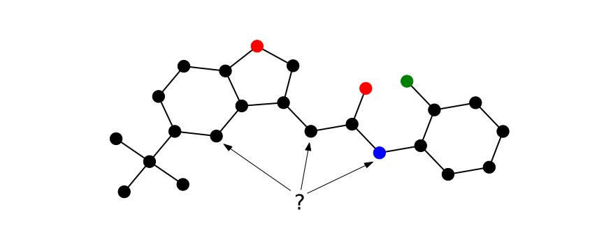

Title: Graph Positional Encoding
Date: 2024-01-24
Category: Network Science
Tags: graph-neural-network
Author: Simon Popelier
Summary: Encoding structure and position for attention on graphs.
JS: molecule_pe.js (bottom), laplacian_similarity.js (bottom), random_walk_similarity.js (bottom)


# Attention to graphs

The attention mechanism popularized by the famous [Transformer](https://arxiv.org/abs/1706.03762) model can be applied to more than just sequential inputs. As the field of computer vision has proven, it can be applied to images with equal success (e.g. the [ViT](https://arxiv.org/abs/2010.11929) model). Graphs is yet another challenge the Transformer has successfully tackled with models like [Graph Transformer](https://arxiv.org/abs/2012.09699) and [Graphormer](https://arxiv.org/abs/2106.05234). 

To make this transition, we need to change a crucial point in the recipe: positional encodings (PE). These allow the model to see what would otherwise be a set of points as a sequence, an image, or in our case, a graph.

To do this, we need to ask ourselves what makes a particular node stand out from others in a given graph.

<figure>
    
    <figcaption style="text-align: center;">Molecule <i>CC(C)(C)c1ccc2occ(CC(=O)Nc3ccccc3F)c2c1</i> as a graph. What can differentiate atoms from a Transformer perspective?</figcaption>
</figure>

> Note that, we are speaking here of the graph as a structure without additional information on nodes. External node features including their geometric position in space can of course be leveraged in a graph Transformer model, but are not the topic of this article.

# Position

As a first step, the notion of position used by the Transformer on sequences and images can be derived to operate on graphs.

There are positional encodings (PE) such as [sinusoidal](https://arxiv.org/abs/1706.03762) or [RoPE](https://arxiv.org/abs/2104.09864), which give similar representations to elements that are close in the sequence, and distant representations to distant elements.

The idea behind PEs on graphs is the same. It involves characterizing nearby nodes, e.g. having the shortest path short, by close embeddings, and distant nodes by distinct representations.

One of the most commonly used methods is to choose the [eigenvectors of the Laplacian matrix](https://arxiv.org/abs/2003.00982) of the graph. These behave like sinusoids at different frequencies on 1-D sequences.

This allows a Transformer model to assimilate in which part of the graph it operates.

<figure style="padding-left: 0px;margin-left: 0px;">
<div id="laplacian_similarity"></div>
<figcaption style="text-align: center;">Laplacian encoding node similarity on a molecule from the 
<a href="https://paperswithcode.com/dataset/zinc">ZINC dataset</a>. Hover nodes to reveal the raw attention weights from one node to all the others using the first 10 eigenvectors.</figcaption>
</figure>

This mechanism is also inherently lacking in message-passing ([MPNN](https://paperswithcode.com/method/mpnn)) models, so these embeddings are also used in these paradigms.

It is possible to use that method easily with the [PyG](https://pyg.org/) library:

```python
import networkx as nx
from torch_geometric.transforms import AddLaplacianEigenvectorPE

G = nx.karate_club_graph()
data = from_networkx(G)

laplacian = AddLaplacianEigenvectorPE(10)
data = laplacian.forward(data)

>>> Data(edge_index=[2, 156], club=[34], weight=[156], name='Zachary's Karate Club', num_nodes=34, laplacian_eigenvector_pe=[34, 10])
```

Laplacian PE are actually a hybrid type of encodings. More than the position alone, they also encode structural information. 

# Structure

The position of a node is not enough to fully characterize it in the eyes of an attention model. Indeed, if for a sequence of words or an image the structure is implicit: a one-dimensional string, a uniform lattice. This is no longer the case when we're interested in a graph. So we need to find a way of transcribing the structure of the network itself.

In the MPNN models mentioned above, this is done mechanically, with a default power equivalent to the 1-[Weisfeiler-Lehman test](https://en.wikipedia.org/wiki/Weisfeiler_Leman_graph_isomorphism_test). This is a test to discern whether two graphs are isomorphic for certain graph types. We are looking for a representation that allows us to distinguish between different graphs with as much flexibility as possible.

The aim of structural embedding is to associate a snapshot of its neighboring environment with a node. Two nodes with a similar surrounding structure should then obtain close representations.

One popular method is [Random Walk encodings](https://arxiv.org/abs/2110.07875). It encodes the probability of a random walk starting from a node and ending on that same node after *k* steps. It depends on, and therefore reflects, the surrounding structure of the node.

<figure style="padding-left: 0px;margin-left: 0px;">
<div id="random_walk"></div>
<figcaption style="text-align: center;">Random walk encoding node similarity from the <a href="https://paperswithcode.com/dataset/zinc">ZINC dataset</a>. Hover nodes to reveal the raw attention weights from one node to all the others using the first 10 path length.</figcaption>
</figure>

In the same way, [PyG](https://pyg.org/) allows for such encoding:

```python
import networkx as nx
from torch_geometric.transforms import AddLaplacianEigenvectorPE

G = nx.karate_club_graph()
data = from_networkx(G)

laplacian = AddLaplacianEigenvectorPE(10)
data = laplacian.forward(data)

>>> Data(edge_index=[2, 156], club=[34], weight=[156], name='Zachary's Karate Club', num_nodes=34, laplacian_eigenvector_pe=[34, 10])
```

# Conclusion

The Transformer is an extremely flexible model and can be applied once again with excellent results in the graph domain. It does, however, need to adapt its perception of graph nodes. This is achieved through positional encodings in two ways: position and structure.

Numerous research papers are still being published on the subject. The aim is to make representations as powerful in terms of node distinction and generalizable across graphs as possible.

Recent approaches explore learned representations such as [LSPE](https://arxiv.org/abs/2110.07875) and [GPSE](https://arxiv.org/abs/2307.07107) rather than arbitrarily defined.

The development of new techniques will make it possible to better combine the now indispensable Transformer architecture with the incredible richness of graph representations.

# References

Dosovitskiy, Alexey et al. 2021. « An Image is Worth 16x16 Words: Transformers for Image Recognition at Scale ». http://arxiv.org/abs/2010.11929 (26 janvier 2024).

Dwivedi, Vijay Prakash, Chaitanya K. Joshi, et al. 2022. « Benchmarking Graph Neural Networks ». http://arxiv.org/abs/2003.00982 (28 janvier 2024).

Dwivedi, Vijay Prakash, Anh Tuan Luu, et al. 2022. « Graph Neural Networks with Learnable Structural and Positional Representations ». http://arxiv.org/abs/2110.07875 (28 janvier 2024).

Liu, Renming et al. 2023. « Graph Positional and Structural Encoder ». http://arxiv.org/abs/2307.07107 (28 janvier 2024).

Mialon, Grégoire, Dexiong Chen, Margot Selosse, et Julien Mairal. « GraphiT: Encoding Graph Structure in Transformers ».

Su, Jianlin et al. 2023. « RoFormer: Enhanced Transformer with Rotary Position Embedding ». http://arxiv.org/abs/2104.09864 (28 janvier 2024).

Vaswani, Ashish et al. 2023. « Attention Is All You Need ». http://arxiv.org/abs/1706.03762 (28 janvier 2024).

« Papers with Code - A Generalization of Transformer Networks to Graphs ». https://paperswithcode.com/paper/a-generalization-of-transformer-networks-to (10 février 2024).

Ying, Chengxuan et al. 2021. « Do Transformers Really Perform Bad for Graph Representation? » http://arxiv.org/abs/2106.05234 (10 février 2024).
