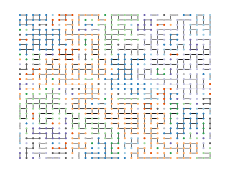
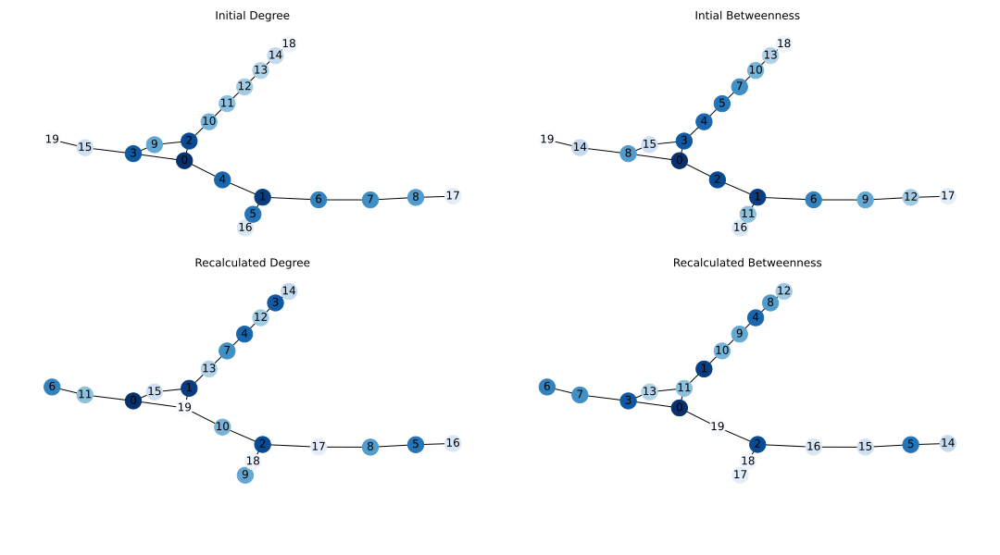
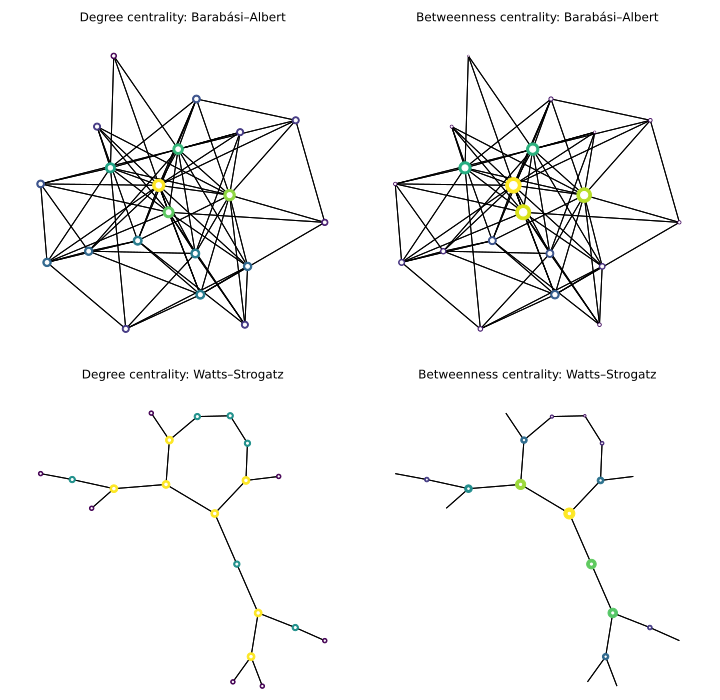
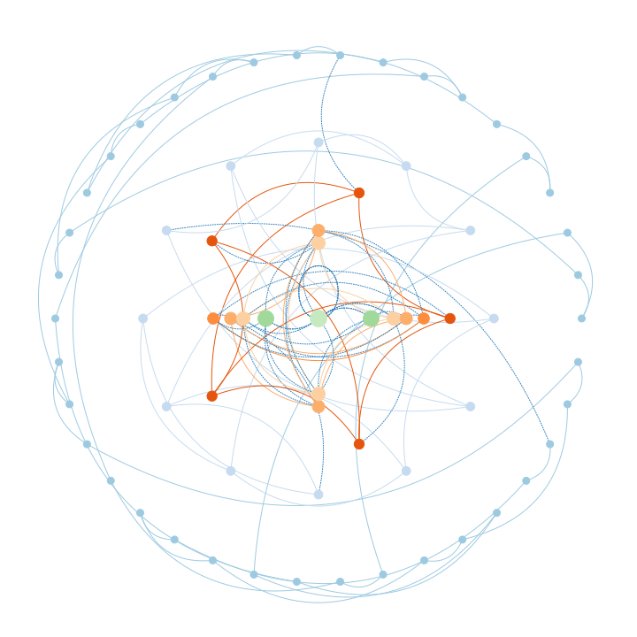

Title: Network Robustness & Vulnerability
Date: 2023-04-10
Category: Network Science
Tags: graph-robustness, theory
Author: Simon Popelier
Summary: Overview of vulnerabilities of networks to different attacks.

# Introduction

This article will introduce the concept of robustness in networks and graphs, and strategies to both attack and defend them. 

The robustness or, conversely, the vulnerability of a network corresponds to its ability to function despite the disabling or poisoning of some of its infrastructure. In particular, its edges or nodes.

In this article, we will describe different metrics and strategies to attack or defend a network.

### Terminology

Concerning the terminology, it is common to hear about networks or graphs. We talk more about networks when we describe a real system, in an applied domain. Conversely, we speak more of a graph when it is a mathematical representation, for example of a network. Similarly, we speak of Network Theory and Graph Theory. For the former, we speak more of nodes and links while the latter adopts the terms vertices and edges.

# Problem Duality

It should be noted that depending on the network’s purpose, attack and defense will have different and sometimes opposite meanings.

## Opposite paradigms

### Decoupling

For networks whose purpose is to diffuse information across nodes, an attack implies the disconnection of parts of its span.  

An example of that would be an electric grid that is subjected to failures and should withstand any large-scale outage. 

An attack on these types of networks consists of cutting off access to these resources to as many parts of the network as possible.

### Propagation / Entity Dissemination

On the other hand, networks may be abused for the propagation of information or diseases. In that case, defending a network means curving the flow of undesired entities. 

For example, epidemiology studies ways to most efficiently prevent a virus from infecting people in a social interaction network. 

Defense, for this type of network, means monitoring (removing) nodes, exactly the opposite of the previous situation.

## Modeling and simulation

### Percolation theory

When it comes to decoupling a network, percolation theory is used to estimate the vulnerability of a network.

As described in (Network Science by Albert-László Barabási, s. d.), percolation theory is a physics and mathematics branch that studies the connectivity of graphs and particularly lattices when disabling their edges with an equal probability.

The name comes from the comparison that can be made between a network and a pipeline of pipes filled with a liquid. If these pipes are connected (the nodes belong to the same component), the fluid flowing through them is the same.

The most classic case of study in this theory is that of a lattice (a graph that can be represented as a matrix) for which we impose a probability $p$ to delete an edge.

<figure>
    
    <figcaption style="text-align: center;">Lattice percolation with colored components</figcaption>
</figure>

The percolation theory provides access to information such as:

- The average cluster size within the network after removing edges.
- The minimum probability $p$ at which there is no more *giant cluster*. In reality, we prefer to talk about inverse percolation noted $f= 1 - p$.
- The probability that a node belongs to the largest cluster
- The average distance between two nodes of the same cluster

This theory is used in the study of attacks on a network or their defense. An example is the study of forest fires and their possible containment.

### Network diffusion

Conversely, when we are interested in the propagation of a signal or a state on a network, the theory of network diffusion. Still recently highlighted by the COVID-19 pandemic, the SIS (susceptible-infected-susceptible) or SIR (susceptible-infected-removed) models are classical models allowing for simulation of the effect of propagation in time.

# Scenarios

Speaking about attacks is an abuse of language. This term may refer to different scenarios. 

### Natural failures

At first, we can consider that the "attacks" are in reality simple failures. This means that they are likely to arrive randomly at points in the network, without these being chosen explicitly for their particular attributes. In the *decoupling* paradigm, that means the removal of random nodes of the network. In the *infection* paradigm, that means infection of a random node in the network.

### Targeted Attacks

Conversely, it is an attack when certain nodes in the network are deliberately made to be targeted. This allows the attacker to choose the nodes rather than target them randomly and thus benefit from potentially more effective strategies with a similar budget.

### Cascading

If the attack becomes widespread enough on the network, it can lead to a chain effect, known as a cascade. This implies that the failure of a node in the network is passed on to other nodes that try to replace it if they are then subjected to too much stress. The nodes then fail, not because they are directly attacked, but indirectly because of their over-exploitation.

To study this phenomenon, we can define new parameters such as:

- The capacity of a node $c \in [0, 1]$.
- The load of a node $l$
- Network redundancy $r$: percentage of nodes dedicated to replacing other nodes in case of failure (and not allocated to new parts of the network)

# Robustness and Vulnerability Metrics

## Measuring robustness and vulnerability

In order to measure the vulnerability of a network, we can use a span of different methods. We can split these methods into more classical graph theory methods and methods based on spectral graph theory, and more specifically the Laplacian eigenvalues. For each metric, we will give a quick description and the reason it can be used as a robustness or vulnerability indicator.

Similar metrics can be used for both paradigms, although with opposite interpretations.

### Classical Methods

- **Connectivity**:

Outside of binary connectivity, “Are any two nodes in the graph connected?”, connectivity can be computed on both edges and nodes. 

Vertex connectivity: Minimal number of vertex removal is required to disconnect the graph. 

Edge connectivity: Minimal number of edge removal required to disconnect the graph. 

They are one of the most intuitive measures we will talk about here since they represent in itself the scenario of an attack aiming at disconnecting the graph, and how many targets it should hit. 

- **Betweenness:**

Betweenness can equally be computed on both edges and nodes. It represents the shortest paths going through an edge or a node. 

$$
b_x = \sum_i\sum_j\frac{n_{ij}(x)}{n_{ij}}
$$

With $n_{ij}$ the number of shortest paths between $i$ and $j$, and $n_{ij}(x)$ the number of such shortest paths going through an edge or vertex $x$.

This metric is originally used for measuring centrality in networks. If the network only uses the shortest paths to function, we can see how betweenness relates to vulnerability. It gives us the number of paths disturbed by the removal of an edge or a vertex. 

However, this metric fails to encapsulate the possibility of using backup paths for the network to work.

- **Distance:**

Distance in a network relates to the number of edges one has to take to go from one vertex to another. Two metrics at least are relevant to summarize distances in the graph: 

Average distance: corresponds to the average distance between every pair of nodes in the graph. 

$$
\bar{d} = \frac{2}{n(n-1)}\sum_i\sum_j d_{ij}
$$

Diameter: corresponds to the maximum distance between any two nodes in the graph.

$$
d_{max} = \max_{i,j}(d_{ij})
$$

These metrics although not related to robustness at first glance, can indicate a strong network. Shorter paths usually are stronger than longer ones since less constitutive elements can be targeted to destroy them. 

- **Reliability Polynomial**:

The reliability polynomial is a statistical measure that observes the probability of a graph disconnecting when removing its edges independently with a probability $q = 1-p$.

This total probability can be computed:

$$
Rel(G) = \sum_{i=0}^m F_i(1-p)^ip^{m-i}
$$

With $F_i$ the number of possible sets of $i$ edges if when removed, keep the graph connected. 

This metric describes very naturally the risk of failure in the graph and its result in disconnecting it. However, one downside is that it is needed to choose a value for $p$ that may come as arbitrary.

- **Clustering:**

The clustering coefficient focuses on counting the proportion of triangles among the possible triangles in connected nodes. That is if a node $k$ connects to $i$ and $j$, are $i$  and $j$ connected as well? The formula can be written as follow:

$$
C = \frac{number\;of\;closed\;triplets}{number\;of\;triplets}
$$

This metric focuses on backup paths since it shows in how many situations, the removal of an edge can directly be replaced by the two other edges in a triangle. 

### Spectral Methods

Spectral methods resort to the analysis of the adjacency matrix of the graph, and more precisely to the Laplacian matrix, computed by $L = \Delta - A$ where $A$ is the adjacency matrix and $\Delta$ the degree matrix. Matrix $L$ has particular properties, some of which we can extract from its eigenvalues.

- **Algebraic connectivity**:

Algebraic connectivity is the name given to the second-largest eigenvalue of the Laplacian. It holds the following property: 

$$
0  \leq \lambda_2 \leq \kappa_v
$$

with $\kappa_v$ the vertex connectivity of the graph. This gives us quickly an approximation of that value which is in turn related to robustness.

- This first and less interpretable measure however serves as an approximation of vertex connectivity. It corresponds to the value of the second largest eigenvalue from the Laplacian matrix of the graph. It has been proven that this value respects the following equation: 0 ≤ λ2 ≤ κv ≤ κe
- **Minimum Spanning Tree:**

The number of spanning trees in a graph can be obtained by the following formula:

$$
\xi = \frac{1}{n} \prod_i^n \lambda_i 
$$

Removing an edge from any of them should be compensated by the edge of another spanning tree.

- **Effective resistance:**

This metric is inspired by electric networks. In this representation, we assign a resistance of 1 Ohm to each edge in the network and compute the total resistance summing resistance between each pair of nodes. This value can be acquired using spectral eigenvalues using the following formula: 

$$
R = n \sum \frac{1}{\lambda_i}
$$

This metric allows us to take into account the addition of any edge to the graph, which is not always the case with previous measures. 

# Containment & Isolation Strategies

There are several ways to try and decouple/isolate a network deliberately. This corresponds to an attack in the *decoupling* paradigm or a defense strategy for the *infection* paradigm. 

Assuming that we target a vertex or an edge at a time, we must choose an order of priority in which to attack these targets. There are two main axes that can be broken down into four types of strategies.

The axis of the metric to prioritize: degrees or betweenness. It is necessary to determine a metric to prioritize the element to be attacked first. It can be the degree of a vertex. The goal here is to remove a maximum of edges in one go. A second metric often used is betweenness, which allows the maximization of the number of shortest paths instead.

The axis of the planning frequency of the attack: initial or recalculated. It is possible to determine the complete order of the element to attack based on the network before any modification or to decide the next element to attack depending on the network state after each attack.

We, therefore, speak of Initial Degrees, Initial Betweenness, Recalculated Degrees, and Recalculated Betweenness.

<figure>
    
    <figcaption style="text-align: center;">Attack node order using different strategies</figcaption>
</figure>

### Degree so Betweenness correlation

Intuitively, we can think that one or the other of the metrics is equal because they are probably highly correlated. However, their correlation is not so obvious and depends a lot on the type of network we are studying. Thus, on certain types of networks, the use of one or the other will result in a very different order and thus a variable result.

For example, scale-free networks such as those generated by the Barabási-Albert model show a strong correlation between these two metrics. On the other hand, models that involve more clustering show a lower correlation. This is the case of the Erdős-Rényi and Watts-Strogatz models.

<figure>
    
    <figcaption style="text-align: center;">Degree & Betweenness</figcaption>
</figure>

### Initial vs Recalculated

It seems quite natural to consider that the recalculated version will always perform better than its initial alternative. However, it is not always possible to apply it. Indeed, if the state of the network is not known throughout the operation, we will have to make do with the initial state. This can be the case when the network tries to defend itself, for example in a social network that is aware that it is under attack. That said, even in the absence of network reaction, taking into account the impact of each deletion can lead to a very different and much more effective order.

How well the recalculated alternative outperforms its counterpart depends again on the type of network.

# Flow sustain strategies

Improving the flow of graphs, as measured with the previously presented metrics can be achieved via different methods. Some may be easier to realize in practice depending on the kind of network, and some may be more effective in theory.

This corresponds to defending a network for the *decoupling* paradigm, or inversely, to make it more vulnerable to attacks in the *infection* paradigm. 

We will try to give a first list of such methods and describe each the feasibility and effectiveness.

### Edge addition

Edge addition is the strongest approach for defending a network although it is not always possible to implement. Trying to make the graph fully connected is often very costly. 

- **Random addition**: adds an edge between two random nodes.

This may be the simplest approach and tends to create graphs with properties closer to random Erdős-Rényi graphs, known to be more robust than real-world networks.

- **Preferential addition**: adds an edge connecting two nodes with the lowest degrees.

As proposed by (Chujyo & Hayashi, 2022) adding edges can be made more efficient if the side nodes are chosen wisely. They prove that on certain categories of networks such as scale-free networks choosing low-degree nodes that initially have large distances is optimal for improving robustness.

### Edge rewiring

Just like in the brain network connections, another approach to optimize the diffusion is to rewire edges instead of adding new ones (Rentzeperis & van Leeuwen, 2021). 

- **Random edge rewiring**: removes a random edge and adds one between two randomly chosen nodes.

This method is known to create onion-like structures with high-degree nodes in the center and decreasing degrees by radial distance to this center (Louzada et al., 2013). It has been shown to be a very robust structure.

<figure>
    
    <figcaption style="text-align: center;">Onion-like Graph</figcaption>
</figure>

Note: These methods assume complete information on the side of nodes, which may not be the case. For example in peer-to-peer networks, a more likely assumption would be that a node only knows its neighbors, and has to choose rewiring within its vicinity (e.g. second hop neighbor) (Csardi et al., 2004). 

- **Random neighbor rewiring**: randomly selects the neighbor of a node and removes the edge. An edge is then added using the remaining node and another node, chosen randomly.
- **Preferential random edge rewiring**: selects an edge, disconnects the higher degree node, and reconnects to a random one.

There are actually many more variants more or less effective depending on the type of network. Oftentimes, preferential rewiring can be adapted so that it maximizes its effect depending on how the edge(s) to rewire is chosen. (Louzada et al., 2013) Designs a method to rewire edges between neighbors of neighbors so that an onion-like network is found quicker than its random alternative. 

Some other methods exist relying for example on motifs correlated with robustness (Ni et al., 2022).

An interesting note to conclude is that rewiring is actually used as an adversarial attack paradigm against Graph Neural Networks, to induce them in error (Ma et al., 2021). 

# Conclusion

This article presented two main vulnerabilities in networks: vulnerability to decoupling and vulnerability to abuse of propagation. Both are opposite but one can resort to similar metrics to measure the robustness of either of them, however with a different interpretation. 

Different strategies may be set up in order to defend a network from attacks. We presented the classics for both paradigms and explained their benefits and drawbacks. 

This article only scratches the surface of the topic, and more can be found exploring subjects like *network robustness*, *epidemiology*, or *percolation theory* just to name a few.

# Bibliography

Baras, J. S., & Hovareshti, P. (2009). Efficient and robust communication topologies for distributed decision making in networked systems. *Proceedings of the 48h IEEE Conference on Decision and Control (CDC) held jointly with 2009 28th Chinese Control Conference*, 3751‑3756. [https://doi.org/10.1109/CDC.2009.5400448](https://doi.org/10.1109/CDC.2009.5400448)

Chan, H., & Akoglu, L. (2016). Optimizing network robustness by edge rewiring : A general framework. *Data Mining and Knowledge Discovery*, *30*(5), 1395‑1425. [https://doi.org/10.1007/s10618-015-0447-5](https://doi.org/10.1007/s10618-015-0447-5)

Chan, H., Akoglu, L., & Tong, H. (2014). Make It or Break It : Manipulating Robustness in Large Networks. In *Proceedings of the 2014 SIAM International Conference on Data Mining (SDM)* (p. 325‑333). Society for Industrial and Applied Mathematics. [https://doi.org/10.1137/1.9781611973440.37](https://doi.org/10.1137/1.9781611973440.37)

Chen, C., Tong, H., Prakash, B. A., Tsourakakis, C. E., Eliassi-Rad, T., Faloutsos, C., & Chau, D. H. (2016). Node Immunization on Large Graphs : Theory and Algorithms. *IEEE Transactions on Knowledge and Data Engineering*, *28*(1), 113‑126. [https://doi.org/10.1109/TKDE.2015.2465378](https://doi.org/10.1109/TKDE.2015.2465378)

Chujyo, M., & Hayashi, Y. (2022). Adding links on minimum degree and longest distance strategies for improving network robustness and efficiency. *PLOS ONE*, *17*(10), e0276733. [https://doi.org/10.1371/journal.pone.0276733](https://doi.org/10.1371/journal.pone.0276733)

Crucitti, P., Latora, V., & Marchiori, M. (2004). A model for cascading failures in complex networks. *Physical Review E*, *69*(4), 045104. [https://doi.org/10.1103/PhysRevE.69.045104](https://doi.org/10.1103/PhysRevE.69.045104)

Csardi, G., Young, M., Sager, J., & Haga, P. (2004). *Self-Repairing Peer-to-Peer Networks* (arXiv:cond-mat/0408248). arXiv. [http://arxiv.org/abs/cond-mat/0408248](http://arxiv.org/abs/cond-mat/0408248)

Ellens, W., & Kooij, R. E. (2013). *Graph measures and network robustness* (arXiv:1311.5064). arXiv. [https://doi.org/10.48550/arXiv.1311.5064](https://doi.org/10.48550/arXiv.1311.5064)

Freitas, S., Yang, D., Kumar, S., Tong, H., & Chau, D. H. (2021). *Evaluating Graph Vulnerability and Robustness using TIGER* (arXiv:2006.05648). arXiv. [https://doi.org/10.48550/arXiv.2006.05648](https://doi.org/10.48550/arXiv.2006.05648)

Holme, P., Kim, B. J., Yoon, C. N., & Han, S. K. (2002). Attack vulnerability of complex networks. *Physical Review E*, *65*(5), 056109. [https://doi.org/10.1103/PhysRevE.65.056109](https://doi.org/10.1103/PhysRevE.65.056109)

Louzada, V. H. P., Daolio, F., Herrmann, H. J., & Tomassini, M. (2013). Smart Rewiring for Network Robustness. *Journal of Complex Networks*, *1*(2), 150‑159. [https://doi.org/10.1093/comnet/cnt010](https://doi.org/10.1093/comnet/cnt010)

Ma, Y., Wang, S., Derr, T., Wu, L., & Tang, J. (2021). Graph Adversarial Attack via Rewiring. *Proceedings of the 27th ACM SIGKDD Conference on Knowledge Discovery & Data Mining*, 1161‑1169. [https://doi.org/10.1145/3447548.3467416](https://doi.org/10.1145/3447548.3467416)

*Network Science by Albert-László Barabási*. (s. d.). Consulté 29 avril 2023, à l’adresse [http://networksciencebook.com/](http://networksciencebook.com/)

Ni, Y., Ou, Y., Li, Y., & Zhang, N. (2022). Improve the product structural robustness based on network motifs in product development. *Scientific Reports*, *12*(1), Article 1. [https://doi.org/10.1038/s41598-022-15056-2](https://doi.org/10.1038/s41598-022-15056-2)

Rentzeperis, I., & van Leeuwen, C. (2021). Adaptive Rewiring in Weighted Networks Shows Specificity, Robustness, and Flexibility. *Frontiers in Systems Neuroscience*, *15*. [https://www.frontiersin.org/articles/10.3389/fnsys.2021.580569](https://www.frontiersin.org/articles/10.3389/fnsys.2021.580569)