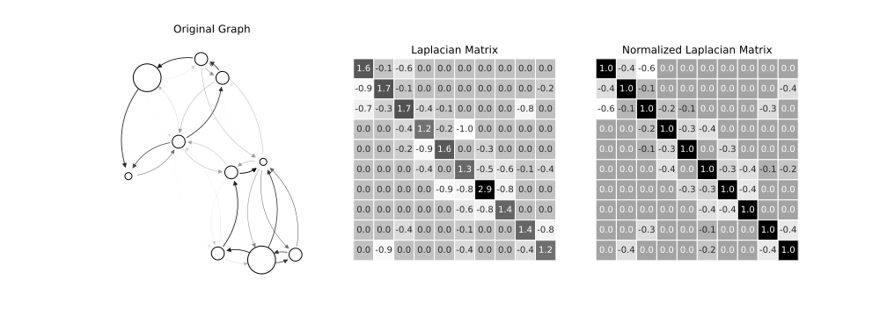

Title: Graph Spectrum Insights: Expansion
Date: 2023-09-04
Category: Graph Theory
Tags: graph-robustness, theory
Author: Simon Popelier
Summary: How to interpret robustness from a Graph's spectrum.
<!-- JS: onion_d3.js (bottom)  -->

# Graph Spectrum Insights: Expansion English version

The Spectrum of a graph is a concept as intimidating as it is informative. Although this mathematical tool may seem abstract at first glance, it provides elegant and synthetic access to the key properties of a graph.

In this article, we'll look at how to intuitively understand the link between the Spectrum and Expansion of a graph, one of the attributes that measures robustness.

## What is the spectrum of a graph?

### Spectrum and Laplacian Matrix

The Spectrum of a graph represents the set of eigenvalues of its normalized Laplacian matrix, a fundamental matrix in Spectral Graph Theory. This matrix is obtained in two stages.

First, by calculating the standard [Laplacian matrix](https://en.wikipedia.org/wiki/Laplacian_matrix):

$$
L = D - A
$$

With $D$ the diagonal [degree matrix](https://en.wikipedia.org/wiki/Degree_matrix) of the graph and $A$ its adjacency matrix.

Then symmetrize this matrix using the following formula:

$$
L^{sym}=D^{1/2}LD^{1/2}
$$

It is from this last matrix: $L^{sym}$ that we extract the spectrum of the graph.

Its eigenvalues are ordered in ascending order, giving for a graph of degree $n$, the eigenvalues $\lambda_1 \leq \lambda_2 \leq ... \leq \lambda_n$: the Spectrum of the graph.

### Spectrum properties

The Laplacian matrix of a graph is symmetrical and real. Its eigenvectors are therefore mutually orthogonal, and its eigenvalues are real.

It is useful to note that we can write:

$$
\lambda = v^tLv = \sum_{(i,j)\in E, i<j}(v(i)-v(j))^2 
$$

with $v$ its associated eigenvector. Note that the eigenvalues of the Laplacian matrix are all positive or zero.

The smallest eigenvalue, $\lambda_1$, always equal to 0 and associated with the eigenvector $u = (1/n, ..., 1/n)$.

In this article, we'll try to provide some insights into the role played by $\lambda_2$ in the study of graph expansion.

## Graph Expansion

[Expansion](https://en.wikipedia.org/wiki/Expander_graph) measures the connectivity of a graph compared to its density. An expander graph is a sparse but highly connected graph.

The expansion of a graph is a sought-after property. It guarantees the absence of bottlenecks in a graph and its robustness. This is the case, for example, in Graph Neural Networks research [(Deac, Lackenby, and Veličković 2022)](http://arxiv.org/abs/2210.02997) to improve information propagation.

## How does $\lambda_2$ tell you about the expansion of a graph?

At first glance, it may be difficult to see why these values are connected to this or that property of the graph.

### Intuition n°1 - From component to bottleneck

The first intuition we can give the reader is to think of the limiting case where $\lambda_2 = 0$.

In this case, the graph is not fully [connected.](http://xn--connect-hya.il/) There are at least two components.

> In fact, it's possible to count the exact number of graph components by counting the number of eigenvalues equal to 0.
    

Indeed, $\lambda_2 = 0$ means that there is an eigenvector $v_2$ orthogonal to $u$ for which the following equation is satisfied:

$$
\sum_{(i,j)\in E, i<j}(v_2(i)-v_2(j))^2 = 0
$$

1. The sum can only be zero if each term is zero. This implies that in this vector, $v_2$, every pair of neighbors in the graph is assigned an equal value: $v_2(i) = v_2(j) \forall i \sim j$ .
2. The vector $v_2$ must be orthogonal to $u$. This means it can't contain just one value; there must be at least two different values in $v_2$: $\exist_{j, i} \mid v_2(i) \neq v_2(j)$

We therefore conclude from 1. and 2. that there must be at least two groups of values which are not adjacent to each other. At least two components.

The first intuition is as follows:

> If $\lambda_2 = 0$ gives a disconnected graph, we'll expect that a value closer and closer to 0 will give a graph closer and closer to decoupling.

### Intuition n°2 - Conductance

A second intuition proposed here is based on the concept of [graph conductance](https://en.wikipedia.org/wiki/Conductance_(graph)).

This measure is given by the following formula:

$$
\phi(G) = \min_{S, |S| \leq n/2} \frac{E(S, \bar{S})}{|S|}
$$

This involves separating the nodes of a graph into two: those belonging to the set $S$ and the others. The conductance is given for the distribution minimizing the number of edges passing from $S$ to the outside: $E(S, \bar{S})$, divided by the size of the set $|S|$.

The larger $\phi(G)$ is, the harder it is to split the graph in two. The better connected it is.

But it is possible to connect $\lambda_2$ and $\phi(G)$. The easiest way to do this is to consider the case of a $d$-regular graph (each node is of degree $d$).

We therefore have:

$$
\lambda_2 = min_{x \perp u} \frac{\sum_{i\sim j}(x_i - x_j)^2}{d \sum x_i^2}
$$

for $x \in \R^n$.

We then carry out a second simplification by discretizing the space of $x$. Consider that they take values in $\{0, 1\}^n$ only.

Under these conditions, we can equate the value 1 with membership of $S$ and 0 with exclusion from the set. With this interpretation, we have the relationship between $\lambda_2$ and $\phi(G)$ with :

$\sum_{i\sim j}(x_i - x_j)^2 = E(S, \bar{S})$ et $|S| = \sum x_i^2$

The lower the conductance of a graph, the less well-connected it is. So we intuitively understand that the same applies to $\lambda_2$.

This intuition is linked to the inequality of [Cheeger](https://en.wikipedia.org/wiki/Cheeger_constant_(graph_theory)), fundamental in the spectral theory of Graphs. More details can be found in this [lecture by Shayan Oveis Gharan](https://homes.cs.washington.edu/~shayan/courses/approx/adv-approx-17.pdf).

### Intuition n°3 - Random Walks

As explained in [this lecture](https://people.seas.harvard.edu/~salil/pseudorandomness/expanders.pdf), another way of looking at the connectivity of a graph is to study the [mixing time](https://en.wikipedia.org/wiki/Markov_chain_mixing_time) of its random walks. This is the order of magnitude required for a random walk to reach stationarity.

A low mixing time means that stationarity is reached quickly. This implies that all the nodes in the graph can be reached quickly and that the graph is well connected.

This time, we need to look at a different matrix and therefore a different eigenvalue.

This is the transition matrix, whose eigenvalues follow the following relationship:

$$
\tilde{\lambda} = d(1 - \lambda)
$$

Note also that in our case, $\tilde{\lambda_2} = \max_{\pi}\frac{||\pi M - u||}{||\pi - u||}$.

A small $\tilde{\lambda}$ implies the existence of at least one $\pi$ distribution that can rapidly approach $u$. This means that a random walk can quickly reach any node.

- Indeed, $\pi M$ represents a random walk step.

A low $\tilde{\lambda}$ implies a high $\tilde{\lambda}$. This is in line with the idea that if this value is high, the graph has good connectivity.

This idea is also linked to the concept of the [Spectral Gap](https://en.wikipedia.org/wiki/Spectral_gap) of a graph, an important concept in spectral graph theory.

## Conclusion

This article tries to demystify the graph spectrum, by giving several interpretations of one of these values: $\lambda_2$ and its link with expansion properties.

We gave 3 different intuitions to understand how a low value of $\lambda_2$ meant a low expansion:

1. An intuition appealing to the special case $\lambda_2 = 0$.
2. An intuition based on the conductance metric $\phi(G)$.
3. An intuition based on Random Walks and their mixing time

These are just a few intuitions for which we have placed ourselves in a particular framework. However, they are a good way of getting to grips with the issues involved in graph spectra and understanding how these values may relate to some of the graph's properties.

There are many other uses for the Spectrum, such as counting the components of the graph, its [co-spectrality](https://en.wikipedia.org/wiki/Isospectral) with another graph, a clustering or colorization method. All these uses give Spectral Graph Theory a fantastic practical application.

## Bibliography

1. Deac, Andreea, Marc Lackenby, et Petar Veličković. 2022. « Expander Graph Propagation ». http://arxiv.org/abs/2210.02997
2. Montenegro, Ravi, et Prasad Tetali. 2006. « Mathematical Aspects of Mixing Times in Markov Chains ». Foundations and Trends® in Theoretical Computer Science 1(3): 237‑354.
3. Shayan Oveis Gharan 2015. « Cheeger’s Inequality and the Sparsest Cut Problem » https://homes.cs.washington.edu/~shayan/courses/approx/adv-approx-17.pdf
4. Salil Vadhan. 2012 « Expander Graphs » https://people.seas.harvard.edu/~salil/pseudorandomness/expanders.pdf