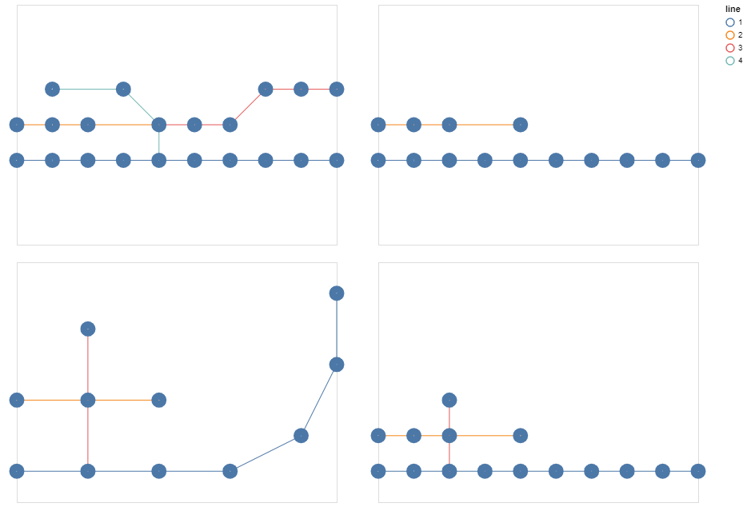
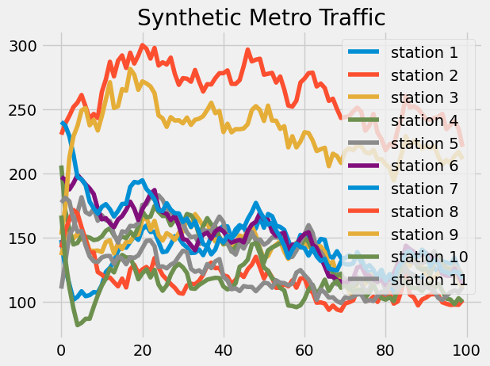
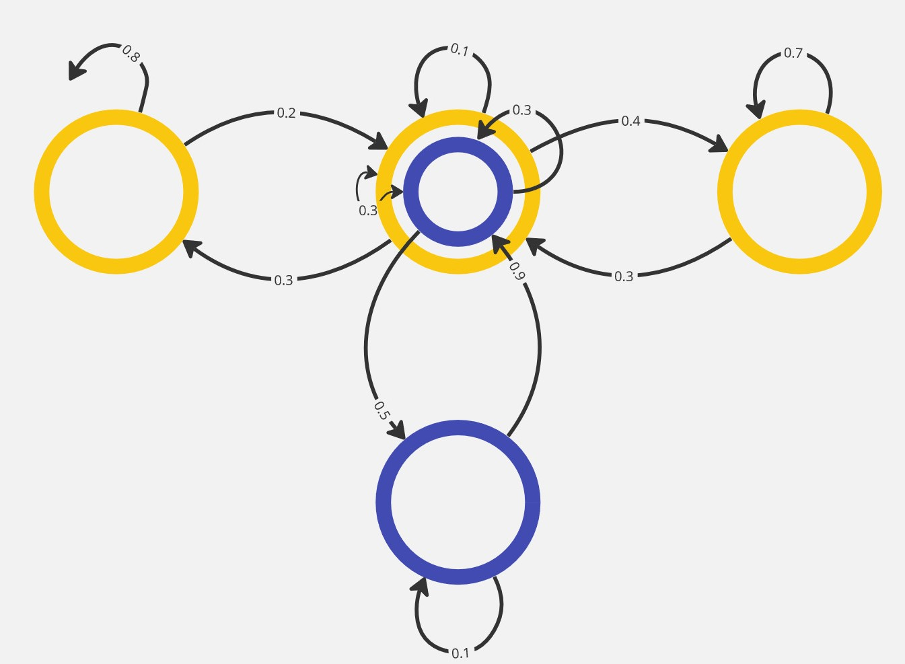
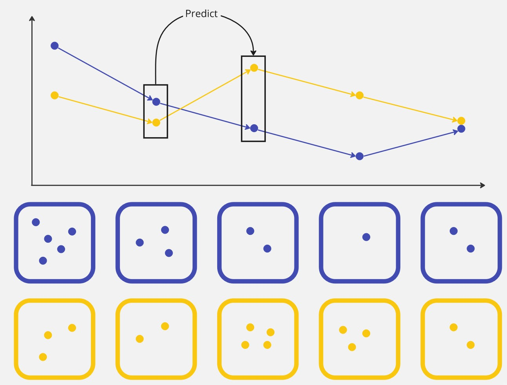
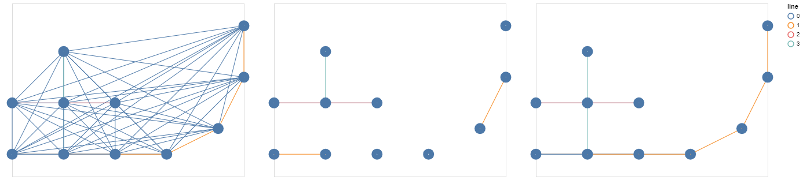
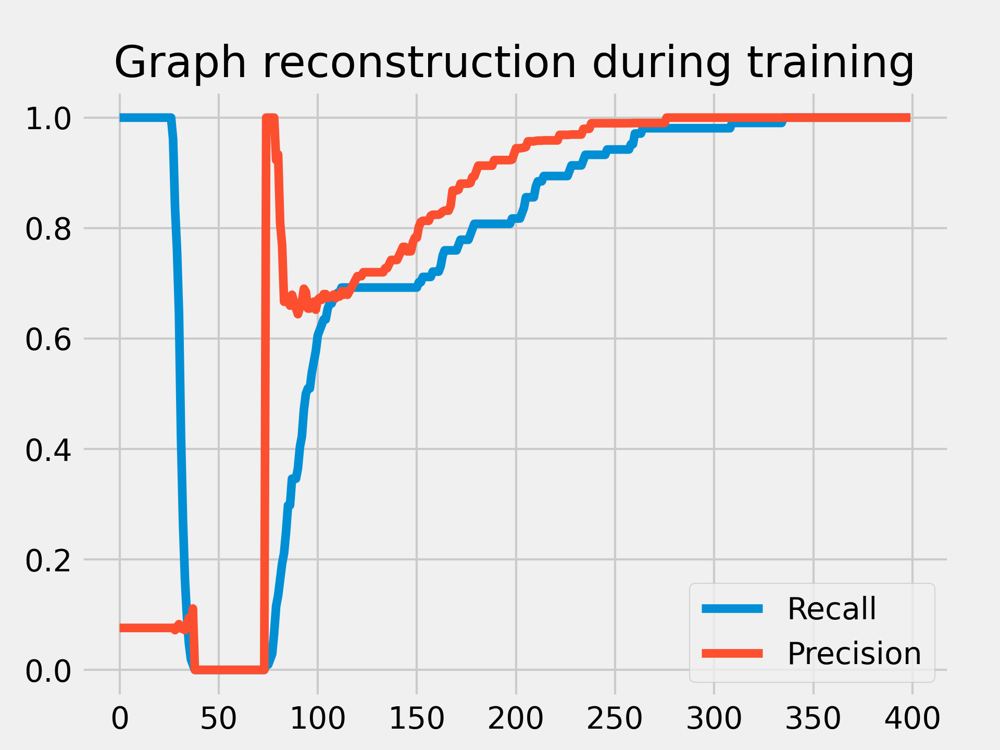
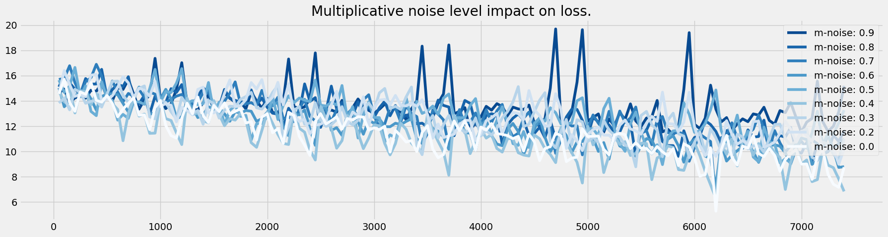
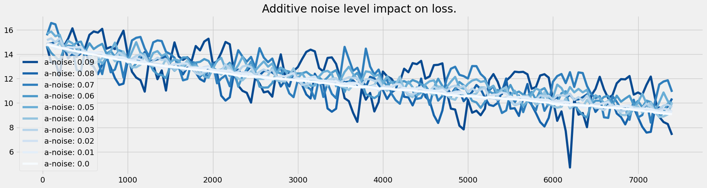
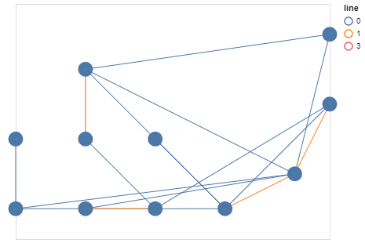

Title: Metro Network Structure Learning
Date: 2023-04-10
Category: GraphML
Tags: graph-structure-learning, practice
Author: Simon Popelier
Summary: Experiment on Graph Structure Learning using a toy Metro synthetic dataset.

# Objective

The goal of this article will be to explore a simple Graph Structure Learning architecture and to study its impact on the traffic prediction of a synthetic subway network.

In particular, we will attempt to observe the graph learned by the model to make its prediction and compare it to the subway network.

We will also try to demonstrate one of the key aspects of Graph Structure Learning methods: resilience, both to noisy data, and to an altered initial graph.

# Data

Data brings together two ideas: 

- The real, underlying network that underlies the data, in this case a synthetic subway line network.
- The process that takes place on the network, here the synthetic traffic of subway users.

## Subway Network

The metro network is created using a manual configuration. 

It specifies the different lines that the network must have and the intersections between these lines.

When instantiating the graph, we actually create 2 nodes per station, per line, for each direction of the line, and an additional node if the station is located at an intersection. 

This additional degree of precision compared to a simple node per station should allow the model to learn more easily to predict the traffic.

However, in the visualizations, we will show the aggregated result per station for a better readability, when possible.



## Markov Process

The signal representing the traffic is also generated synthetically, but in a random and automatic way. 

We initialize the traffic to a random number of people for each station (each node more precisely), then we simulate step by step the signal propagating in the network following a Markov process.



We add to this a degree of uncertainty on the data driven by two parameters:

- Additional noise
- Multiplicative noise



## Objective

The model we will describe in the next section will be auto-regressive: it will try to predict the traffic value based on previous traffic values. 

More precisely, at first, it will only use one step to predict the next one. 

Given the simplicity of the data model, the model will be able to correctly predict the metro traffic with this information only.



# Model

## Graph Structure Learning module

### Direct optimization

In this version of the model, we use a direct optimization technique of the Adjacency matrix. We can define this matrix with PyTorch and initialize it with the following code:

```python
self.matrix = nn.Parameter(torch.empty(self.num_nodes, self.num_nodes), requires_grad=True)
torch.nn.init.kaiming_uniform_(self.matrix, a=2.23)
```

### Embedding

In this version, we rather learn embeddings for each node, which will then be used to evaluate a respective distance, finally giving access to the adjacency matrix. The code used is the following:

```python
self.node_embeddings_start = torch.nn.Embedding(num_nodes, embedding_size, sparse=False)
self.node_embeddings_target = torch.nn.Embedding(num_nodes, embedding_size, sparse=False)
```

Two different embeddings per node are defined. In this way, the $A_{ij}$ stop can be different from  $A_{ji}$ .

### Positivity constraint enforcement

A constraint that we may wish to enforce in the creation of our graph is the positivity constraint of the weights of the edges. This is our case here, since we want to replicate the real process, and we are dealing with the exchange of people between stations, which must be positive. For this, we can use two architectural techniques (as opposed to loss altering): the application of the ReLU function or the exponential function.

```python
# Using exponential function
A = A.exp()
# Using ReLU
A = torch.nn.functional.relu(A)
```

### Sparsity constraint enforcement

A classical constraint when using GSLs, to get closer to reality, is the sparisty constraint. To constrain the graph to respect this, we use an architectural technique by keeping for each node only **k** neighbors.

This method has the advantage of being safe, but the disadvantage of limiting the flexibility of the graph and of inducing a new hyperparameter.

```python
values, indices = A.topk(k=self.neighbor_nb+1, dim=dim)
mask = torch.zeros_like(A)
mask.scatter_(dim, indices, values.fill_(1))
A*mask
```

## Alternatives

For a problem as simplified as this one, it would have been relevant to use other techniques to obtain a similar or better performance in less time.

### Markov Model

Since the data follows a Markov process, one immediately thinks of a modeling using a Markov model (MM, HMM).

The model becomes less relevant if we add a longer time dimension to the data: the traffic at a time t depends not only on *t-1* but also on the previous steps *t-2*, ..., *t-n*.

# Experiments

## Construction of the graph

In this experiment, we study the evolution of the graph construction as the neural network is trained.



We compare the two graphs using two metrics: **recall** and **precision**.

$$recall = \frac{Nb\;edges\;correctly\;learned}{Total\;nb\;reference\;edges}$$

$$precision = \frac{Nb\;edges\;correctly\;learned}{Total\;nb\;learned\;edges}$$



We see that at the initialization of the matrix, the graph is quasi-complete: e.g. every pair of nodes are connected due to the initialization technique of the matrix (`kaiming_uniform`). Then very quickly to satisfy the sparisity constraints, the graph becomes completely disconnected. And finally the balance is learned until the exact graph is found at the end of the training.

We can see these different phases on the illustration of the graph under construction above.

This is a very simple case to find this balance, in a practical case, the graph is never completely found.

## Noisy data

In this experiment, we will use noisy data by manipulating the multiplicative and additive noise hyperparameters. 

We explore the impact that this can have on the performance of the network as well as on the graph retrieval.

### Multiplicative noise

We vary the multiplicative noise between 0 and 1 by steps of 0.1. The formula of the noise added at each step of the signal simulation is the following:

$$A' = A * (1 + m)$$

with $m \in R^n$ and $m_i \sim U(-\frac{level}{2}, \frac{level}{2})$.

We see that learning is impacted by noise, but that the model still manages to learn.



### Additive noise

The same is true for additive noise, which follows the following equation:

$$
A' = A + a
$$

with $a \in R^n$ and $a_i \sim U(-\frac{level}{2}, \frac{level}{2})$



And as for the graph, it is also learned despite the noise. Here is an illustration of the graph under construction during the learning process with an additive noise of 0.1 . We find the beginning of the architecture of the reference network.




# Conclusion

In conclusion, for simple cases such as the one presented in this article, the Graph Structure Learning module fulfills all the functions that can be expected from it:

- Reconstruction of the underlying network: it reconstructs the real network behind the learned signal.
- Resilience to noise in the input signal: it continues to learn the network correctly despite a noisy signal.
- Resilience to graph initialization: it allows retrieving the original network despite a trafficked graph at initialization.

However, it should be noted that the explainability of SLGs can decrease with the increase of the model capacity. Models such as the MTGNN can give a satisfactory performance in the prediction of a signal without giving access to a clear interpretation of the underlying network.

On the other hand, resilience to various adversarial attacks is being sought, including in high-capacity models, and is being actively studied today.

## References

- [GNN Book](https://graph-neural-networks.github.io/gnnbook_Chapter14.html) by Chen, Yu and Wu, Lingfei
- [A Survey on Graph Structure Learning: Progress and Opportunities](https://arxiv.org/abs/2103.03036) by Yanqiao Zhu, Weizhi Xu, Jinghao Zhang, Yuanqi Du, Jieyu Zhang, Qiang Liu, Carl Yang, Shu Wu
- [Connecting the Dots: Multivariate Time Series Forecasting with Graph Neural Networks ](https://paperswithcode.com/paper/connecting-the-dots-multivariate-time-series) by  Zonghan Wu, Shirui Pan, Guodong Long, Jing Jiang, Xiaojun Chang, Chengqi Zhang 