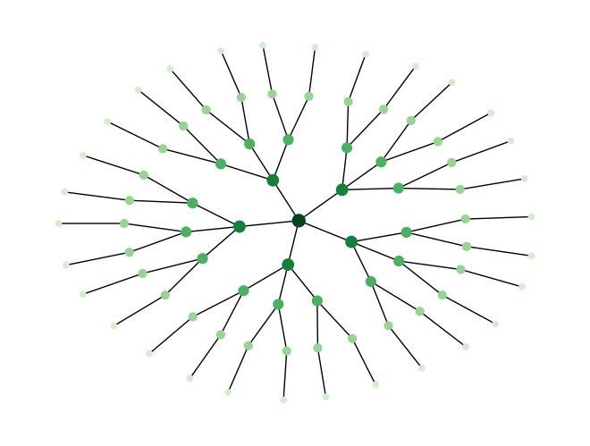
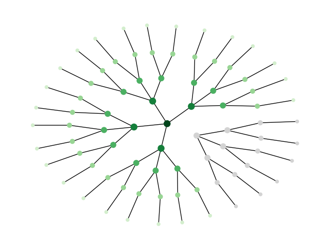
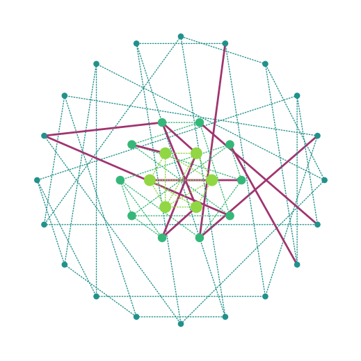
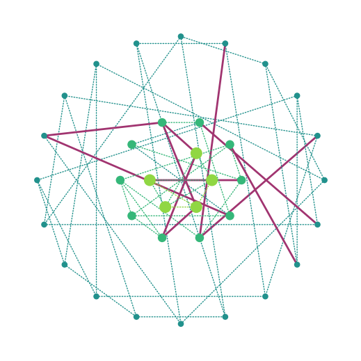
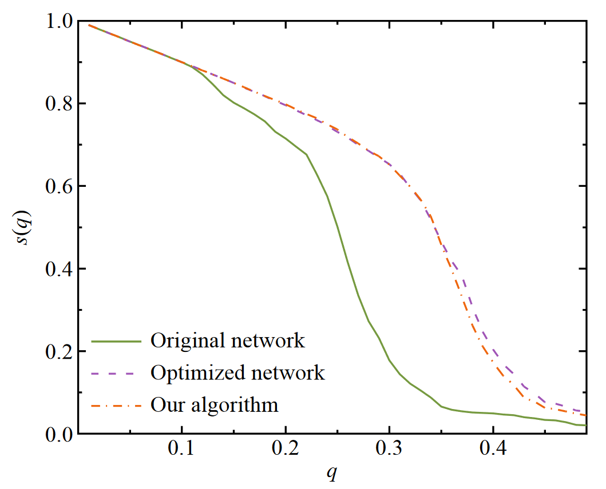

Title: The Onion Topology
Date: 2023-06-11
Category: Graph Theory
Tags: graph-robustness, theory
Author: Simon Popelier
Summary: What makes the onion structured networks special.
JS: onion_d3.js (bottom) 

# Introduction

*This article will explain what Onion Networks are and what sets them appart in the domain of network robustness.*

The onion structure is a kind of network topology adopted by some networks. 

This structure can be decomposed by radial layers hence its name.

A layer is composed of the same degee nodes having an overrepresentation of edges in between themselves.

At the core can be found the highest degree nodes. From there, the degree decreases the more we move to radially distant layers. 

In summary: same degree nodes are likely to be connected to same degree nodes, creating this layering effect degree by degree.

<figure>

<figcaption style="text-align: center;">Interactive onion network</figcaption>
</figure>

They make for a special kind of structure due to their particular robustness to failures and perturbations.

# Robustness

Robustness for networks is often measured in terms of how difficult it is to split the graph apart when successively removing nodes. This comes from the [Percolation Theory](https://en.wikipedia.org/wiki/Percolation_theory) study and designates a network as robust if most of its nodes remain accessible to each other in case of successive failures.

In “most” of its nodes we have to understand, the nodes are part of the main component: the biggest group still connected.

## Scale-Free Networks

Onion networks are scale-free. They should therefore be compared to other scale-free networks.

> “*Scale-free networks are networks whose degree distribution follows a power law*.”  - [Wikipedia](https://en.wikipedia.org/wiki/Scale-free_network) - This means they have few high-degree nodes and exponentially more lower-degree nodes.

For these categories of networks, a good property to have for being robust is *degree assortativity*: nodes like to be connected to same-degree nodes.

Although not all degree assortative graphs are onions, all onions are degree assortative. 

## Intuition

The reason behind the robustness of degree assortative graph can be intuitively seen by taking two opposite examples: 

1. An onion graph: degree assortative.
2. A decreasingly branching tree: not degree assortative.

An attack, if selective, will likely target one of the higher-degree nodes.

Removing such a node in the Tree instantly cuts the entire branch out of the main component. This is because of the hierarchical exclusivity that linked lower-level nodes to this single node to reach the root of the tree (and come back down to communicate to any other node).

<table style="width:100%">
  <tr>
    <td>
    </td>
    <td>
    </td>
  </tr>
  <caption style="caption-side:bottom">Same tree before and after ID removal of a node.</caption>
</table>

Removing such a node in the Onion does nothing like that. There is no hierarchical exclusivity: lower-level nodes that used to be linked to the removed node can still reach the core of the onion through pairs of the same layer still connected to the core, and accessible to them (thanks to assortativity).

<table style="width:100%">
  <tr>
    <td>
    </td>
    <td>
    </td>
  </tr>
  <caption style="caption-side:bottom">Same onion network before and after ID removal of a node.</caption>
</table>

We can thus conclude that onions definitively have nothing to do with trees.

## Experiment

This intuition can be backed by experimenting on attacks and comparing the performance of onion graphs and random other scale-free graphs.

The experience setup starts from intact networks and successively removes node after node. All along that process, we count the number of nodes still connected to the *main component*: the largest cluster of nodes still in reach one of the other.

The largest this component remains, the more robust the network structure is deemed. 

This result is highly dependent on the order in which we chose to target nodes. 

Generally, the node order strategy is chosen among four flavors:
- Initial Node Degrees (ID): Target the highest node degree computed on the initial network.
- Initial Node Betweenness (IB): Target the highest node betweenness computed on the initial network.
- Recomputed Node Degrees (RD): Target the highest node degree computed on the current state network (after all the previous removals).
- Recomputed Node Betweenness (RB): Target the highest node betweenness computed on the current state network (after all the previous removals).

As demonstrated by (Wu & Holme, 2011) in their paper, the Onion graph (orange) is almost as robust as a robustnesss optimized graph (purple), and way better than a similar degree scale-free network (green) for an RD strategy.

# Generation

How to acquire this Onion topology is the subject of this last section.

Initially, the topology has been discovered by optimizing for a robustness metric (Chan & Akoglu, 2016; Louzada et al., 2013; Wu & Holme, 2011). Starting from any graph, the algorithm swapped edges between nodes whenever that could bring an improvement in this metric. 

> The robustness index formula follows: $$R = \frac{1}{N} \sum_{q=\frac{1}{N}} s(q)$$ with $N$, the number of vertices, $s(q)$ is the fraction of vertices in the largest connected cluster after removing $qN$ vertices.

The output of this process, for scale-free networks, systematically adopted the Onion topology.

Therefore, a way to get an Onion structure is to follow this optimization process.

However, (Wu & Holme, 2011) asked themselves whether there could be a more direct method to generate such graphs, and came up with the following algorithm.

*Algorithm: Onion structured network generation.*   

**DEFINE a number N of nodes for the graph.  
FOR each node, sample a degree $d_i$ from a distribution $P (k) ∼ k^{−γ}$.  
ASSIGN each node to its layer $s_i$ given its sampled degree.  
FOR each node, create as many "stubs" as its degree $d_i$. 
WHILE independant "stubs" remain, connect two stubs at random with a probability $\Pi_{ij} = \frac{1}{1 + a|s_i - s_j|}$ with $a$ a control parameter, starting from lowest degree nodes.**

# Conclusion

Onion structure is a particularly robust topology for scale-free networks.

Such networks can be generated not only by optimizing an already existing structure but from the ground up using the presented algorithm.

It proves to resist well against traditional attacks and failures. These are usually focused on high-degree nodes. Although one could wonder what would happen in an attack designed specifically for this topology. What would happen with an attack focusing on the inter-layer nodes in priority?

# References

Chan, H., & Akoglu, L. (2016). Optimizing network robustness by edge rewiring : A general framework. Data Mining and Knowledge Discovery, 30(5), 1395‑1425. https://doi.org/10.1007/s10618-015-0447-5
Louzada, V. H. P., Daolio, F., Herrmann, H. J., & Tomassini, M. (2013). Smart Rewiring for Network Robustness. Journal of Complex Networks, 1(2), 150‑159. https://doi.org/10.1093/comnet/cnt010
Wu, Z.-X., & Holme, P. (2011, août 9). Onion structure and network robustness. ArXiv.Org. https://doi.org/10.1103/PhysRevE.84.026106

